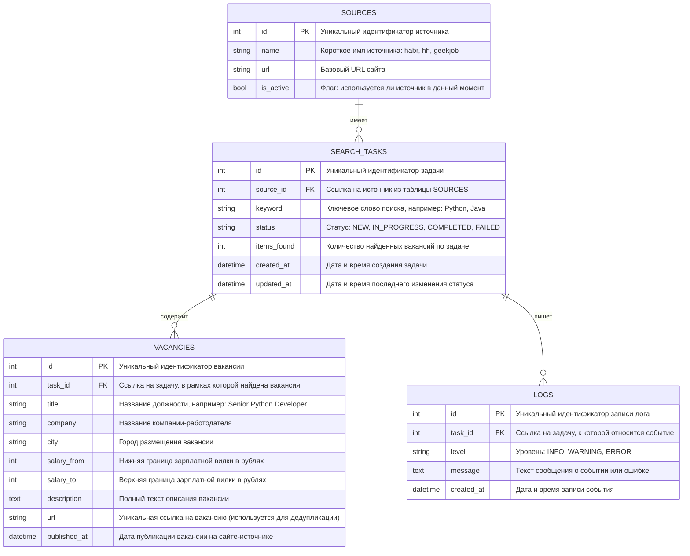

# ER-диаграмма базы данных JobRadar

```mermaid
erDiagram
    SOURCES {
        int id PK "Уникальный идентификатор источника"
        string name "Короткое имя источника: habr, hh, geekjob"
        string url "Базовый URL сайта"
        bool is_active "Флаг: используется ли источник в данный момент"
    }

    SEARCH_TASKS {
        int id PK "Уникальный идентификатор задачи"
        int source_id FK "Ссылка на источник из таблицы SOURCES"
        string keyword "Ключевое слово поиска, например: Python, Java"
        string status "Статус: NEW, IN_PROGRESS, COMPLETED, FAILED"
        int items_found "Количество найденных вакансий по задаче"
        datetime created_at "Дата и время создания задачи"
        datetime updated_at "Дата и время последнего изменения статуса"
    }

    VACANCIES {
        int id PK "Уникальный идентификатор вакансии"
        int task_id FK "Ссылка на задачу, в рамках которой найдена вакансия"
        string title "Название должности, например: Senior Python Developer"
        string company "Название компании-работодателя"
        string city "Город размещения вакансии"
        int salary_from "Нижняя граница зарплатной вилки в рублях"
        int salary_to "Верхняя граница зарплатной вилки в рублях"
        text description "Полный текст описания вакансии"
        string url "Уникальная ссылка на вакансию (используется для дедупликации)"
        datetime published_at "Дата публикации вакансии на сайте-источнике"
    }

    LOGS {
        int id PK "Уникальный идентификатор записи лога"
        int task_id FK "Ссылка на задачу, к которой относится событие"
        string level "Уровень: INFO, WARNING, ERROR"
        text message "Текст сообщения о событии или ошибке"
        datetime created_at "Дата и время записи события"
    }

    SOURCES ||--o{ SEARCH_TASKS : "имеет"
    SEARCH_TASKS ||--o{ VACANCIES : "содержит"
    SEARCH_TASKS ||--o{ LOGS : "пишет"
```
